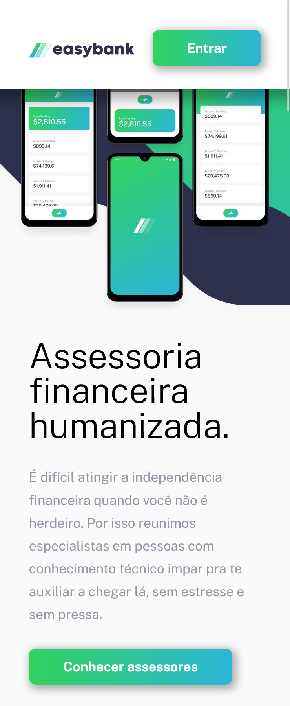

# Easybank frontend app

## Description

Frontend of a fullstack app that connects investors and investment advisors.
The goal of this aplication was to make my first fullstack app using Next at the frontend and Nest at the backend.

## Table of contents

- [Overview](#overview)
    - [Built with](#built-with)
    - [Screenshot](#homepage-screenshot)
    - [Deploy links](#deploy-links)
- [Project Structure](#project-structure)
    - [Scripts](#scripts)
    - [Dependencies](#dependencies)
    - [Dev dependencies](#devdependencies)
    - [Installation](#installation)
    - [Architecture](#architecture)
- [My process](#my-process)
    - [What I learned](#what-i-learned)
    - [Continued development](#continued-development)
    - [Useful resources](#useful-resources)
- [Acknowledgments](#acknowledgments)
    - [Author](#author)

## Overview

### Built with

- Next.js
- Typescript
- Styled components
- Axios
- Radix UI
- React context
- Cookies

### Homepage Screenshot



### Deploy links

- Frontend deploy: [Live App](https://easybank-investments.vercel.app/)
- Backend deploy: [Backend](https://investment-fullstack.onrender.com/)

## Project structure

First, run the development server:

```bash
npm run dev
# or
yarn dev
# or
pnpm dev
# or
bun dev
```

Open [http://localhost:3000](http://localhost:3000) with your browser to see the result.

## Scripts

- `dev`: Inicia o ambiente de desenvolvimento usando o Vite.
- `build`: Usado para construir o aplicativo para produção.
- `lint`: Executa o ESLint para linting e correção automática.

Execute os scripts utilizando `npm run` ou `yarn run`.

## Dependencies

- @hookform/resolvers: ^3.3.4,
- @radix-ui/react-dialog: ^1.0.5,
- @radix-ui/react-dropdown-menu: ^2.0.6,
- @radix-ui/react-icons: ^1.3.0,
- axios: ^1.6.7,
- babel-plugin-styled-components: ^2.1.4,
- nanoid: ^5.0.5,
- next: 14.1.0,
- react: ^18,
- react-dom: ^18,
- react-feather: ^2.0.10,
- react-hook-form: ^7.50.1,
- react-toastify: ^10.0.4,
- styled-components: ^6.1.8,
- yarn: ^1.22.21,
- zod: ^3.22.4

## Dev dependencies

- @swc/plugin-styled-components: ^1.5.116,
- @testing-library/jest-dom: ^6.4.0,
- @testing-library/react: ^14.1.2,
- @types/node: ^20,
- @types/react: ^18,
- @types/react-dom: ^18,
- autoprefixer: ^10.0.1,
- eslint: ^8,
- eslint-config-next: 14.1.0,
- jest: ^29.7.0,
- jest-environment-jsdom: ^29.7.0,
- new-component: ^5.0.2,
- postcss: ^8,
- tailwindcss: ^3.3.0,
- typescript: ^5"

## Installation

1. Clone the frontend repo:

```bash
git clone git@github.com:brunomoleta/Investment-app-client.git
```

2. Clone the backend repo or use :

```bash
git clone git@github.com:brunomoleta/Investment-app-client.git
```

3. Install the dependencies:

```bash
npm install 

# ou 

yarn install
```

## Architecture

```
investing-app-client/
│
├── node_modules/         Dependencies installed in your local environment.
│
├── public/               Public files.
│
├── lib/                  Includes a file to set up Styled-components.
│
├── src/                  Source code
│   ├── app/              Routes;
│   ├── assets/           Static resources such as images, logos and illustrations;
│   ├── components/       React components;
│   ├── providers/        Componentes de gerenciamento de estado global;
│   ├── schemas/          Data validation context;
│   ├── hooks/            Hook functions;
│   ├── services/         API communication service, data and helper functions.
│   ├── styled-components/Styled-components components;
│   ├── types/            Component types;
│   └── ...
```

## Acknowledgments

### Author

- Github - [Bruno Moleta](https://github.com/brunomoleta)
- Frontend Mentor - [@brunomoleta](https://www.frontendmentor.io/profile/brunomoleta)
- LinkedIn - [@brunomoleta](https://www.linkedin.com/in/bruno-moleta-santos/)
- Email - brunomoleta@pm.me 